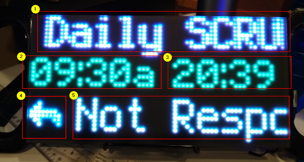

My Next Appointment for Adafruit Matrix Portal
=======================================

The intent of the project is to display information from your calendar about your next appointment on the [Adafruit Matrix Portal](https://www.adafruit.com/product/4745) and an [Adafruit 64x32 RGB LED Matrix](http://www.adafruit.com/product/3826). The appointment information is pulled and through [Adafruit IO](https://io.adafruit.com) loaded by the Matrix Portal for display.

# Background
The motivation for creating this project was the my personal tendency to "snooze" reminders for upcoming appointments which routinely results in me being late joining online calls. Since it takes muliple mouse clicks to adjust the snooze time, the tendency is to accept the default (5, 0, etc. minutes before) and loose track of the up coming event. The concept is to have a continuosly updaing wallboard that displays the next appointment, some minimal information and a count down.

# High Level Design
The approach is to have a client side Python script, where the appointment calendar is easily accessed,  running to pull the "next" appointment's information. The information is posted to an Adafruit IO feed. The Matrix Portal CircuitPython scipt will then pull the appointment information and format for display on the RGB LED Matrix. Since the target device has limited pixels for dsiplay (32x64) some compromises on the information to display are needed. Ultimatly the large size and bight colors on the RGB LED is presumed to mitigate the problem of "snzoozing" reminders provided the display is within the field of view.

## Design Assumptions
The Windows 10 PC Client script is written in Python3 to get appointments through a local Microsoft Outlook application. So the client needs Python3 installed. The [requirements-pc-client.txt](./requirements-pc-client.txt) file defines the required Python libraries.

The user also needs an Adafruit IO account, although the free tier seems sufficent since there should only be one data point in the feed at any point in time. With respect to security while the data is on AIO, there is a Privacy setting where the Visibility Setting can be Private.
> Private means your feed will only be visible to you.

The Matrix Portal need access to a wifi network through which Adafruit IO is accessible.

Installation specific configuration settings are stored in a [secrets.py](./secrets.py) file on both the client and Matrix Portal. See [Internet Connect!](https://learn.adafruit.com/adafruit-matrixportal-m4/internet-connect) for some details.

# Design Details

## PC Client Script

The PC client Python3 script (nextCalAppt.py) accesses the local Microsoft Outlook application using the [pywin32](https://pypi.org/project/pywin32/) library which provides access to the Outlook client application via Windows COM. The implementation was insired by [Python in Office](https://pythoninoffice.com/get-outlook-calendar-meeting-data-using-python/). Many of the details of working with the Outlook COM API were worked out and include in the **Python in Office** article. The script can be kicked off in a command window or with a batch script and will run until killed.

This script pulls a filtered view of appointments from Outlook, looks to see if there are more than one lastest appointments, and sends the following to AIO as a JSON string:

| Name | type | Description |
|------|------|-------|
| start | int | Start time of the meeting  as Unix time |
| subject | str | The Subject or title of the meeting|
| responseStatus | str | Response Status |
| meeting_status | str | Meeting status|

Example:
`{"start": 1605542400, "subject": "Just another meeting", "responseStatus": "Organizer", "meeting_status": "Received"}`

Another client script would just need to follow this interface format for the Matrix Portal script to function.

### Configuration

The appointment returned from Outlook can be a significant list if unfiltered. To narrow the results returned, there are two configuration settings.
* MINUTES_BACK - The number of minutes in the past the script looks for appointments. The idea here is that after an appointment is in progress, it is somewhat not important to display its information. This approach has its limitation. Too small and you run the risk of not seeing the display announcing an appointment has started if you are not looking at the display and there is a hastily scheduled appointment. Too large and the script will look so far back it will obscure an appointment when they are very short in duration. The default is 5.
* DAYS_AHEAD - The number of days to look ahead. This is to allow for meetings starting on Monday to be displayed on Friday afternoon. The default is 2.
* POLL_SECS - Sets the period in seconds for the script to requery the calendar for appointments. There is not much point in looking for appointments too often. The default is 60.

## Matrix Portal Script

The Matrix Portal Script is based on Circuit Python and the supporting libraries for the Adafruit Matrix Portal.

It is important to note that the library for accessing AIO from a Windows Python3 environment is somewhat different that the library available in CircuitPython. So the code between the two Python scripts cannot be fully shared. There are also some other limitations (e.g., no time.strftime() function) that needed to be worked around.

The display is divided into five elements on three display rows:
- Top - Scrolling area for the meeting subject (#1 in Display Example)
- Middle - Time information
    - Left Side - Start time displayed as HH:MM a/p (12 hour time)  (#2)
    - Right Side - Count down to the meeting start displayed as MM:SS (#3)
* Bottom - Response Status information
    - Left - Icon (#4)
    - Right - Response status text (#5)

If there are no meetings to be displayed, a message is visible on the middle line.

### Configuration

* POLL_SECS - like the Client Script is the time in seconds that the Matrix Portal will wait before reconnecting to AIO to get the latest appointment information. The default is 60.

* SUBJECT_SCROLL_LIMIT - To make the display no so busy when the appoitment title is short, you can set how many characters will trigger scrolling of the Subject text. I suspect this is highly dependent on the font used in the The default is 10.

# Attribution

For this project I also used:
- [Minecraft](https://www.dafont.com/minecraft.font) font by Crafton Gaming
- [FontForge](https://fontforge.org) and [Use FontForge](https://learn.adafruit.com/custom-fonts-for-pyportal-circuitpython-display/conversion)

# Future Work

* Don't use the MINUTES_BACK method since it does not handle closly scheduled meetings well.
* Add some visual indication (icon) that the "in progress" appointment is overlapping with the next appointment
* Handle Calendars other than Outlook. For example, Google Calendars or o365 Outlook.
* The current icons in the status bar are not very intuative and the colors are not very pleasing. There is some complications with displaying all the 16 bit colors (see [comment at line 17 in simple_scroller.py)](https://github.com/adafruit/Adafruit_Learning_System_Guides/blob/master/CircuitPython_RGBMatrix/simple_scroller.py)). Consequently, the display in the image editor (e.g., GIMP) is not exactly what you see on the RGB LED display.
* There are buttons on the Matrix Portal which might be useful to display additional appointments or information.
* The Adafruit AirLift ESP-32 Co-processor has BLE, so adding a configuration app connectivity is plausable when CircuitPython BLE support enables that function.
